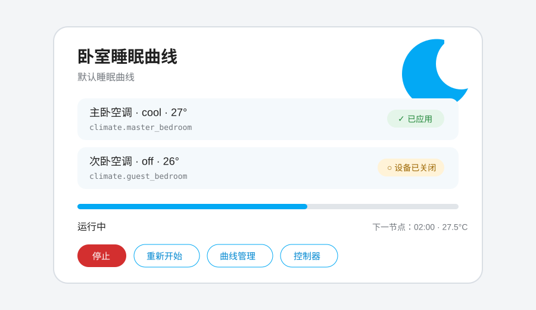

# Climate Sleep Curve Card / 空调睡眠曲线卡片

[](https://github.com/eggleader-zhang/climate-sleep-curve-card/releases)
[](https://github.com/eggleader-zhang/climate-sleep-curve-card/actions/workflows/ci.yml)
[](https://github.com/eggleader-zhang/climate-sleep-curve-card/actions/workflows/validate.yml)

Climate Sleep Curve Card 是 [Climate Sleep Curve](https://github.com/eggleader-zhang/climate-sleep-curve) 的 Home Assistant Dashboard Plugin。它提供适合桌面和移动端的睡眠温度与风量曲线编辑器、控制器配置、会话操作和运行进度展示。

卡片不直接调用空调服务。它通过 Home Assistant 已认证 WebSocket 连接与后端集成通信，实际调温、调风和安全检查全部由后端完成。



## 主要功能

- 创建默认曲线和控制器的首次设置向导。
- 编辑 4～12 小时睡眠温度和风量曲线。
- 选择不控制风速、全程自动风或逐节点风量曲线。
- 使用鼠标、触控或键盘调整每小时温度节点。
- 根据绑定空调的温度范围和步进优化编辑范围。
- 生成推荐舒适曲线。
- 保存、复制和删除曲线。
- 在一个控制器中多选 `climate` 实体并选择默认曲线。
- 在曲线管理中直接设置控制器下一次会话使用的默认曲线。
- 使用 Home Assistant 风格的时间选择器和星期勾选器配置自动启动。
- 通过独立的曲线管理入口新建、查看、编辑、复制和删除多条曲线。
- 配置按时间和星期自动启动。
- 配置互斥的结束动作：安全恢复启动前的目标温度和风速，或自然结束后关闭空调。
- 启动、停止和重新开始会话。
- 显示每台空调的状态、目标温度、最近一次节点执行结果、会话进度和下一节点。
- 图形化卡片编辑器、YAML 配置、深浅色主题、中英文界面。
- 多页面编辑时通过修订号检测并发覆盖。

## 前置条件

在安装卡片前，必须先完成以下事项：

1. 安装并配置 Climate Sleep Curve 后端集成。
2. Home Assistant 中至少存在一个支持目标温度的 `climate` 实体。
3. 使用管理员账户创建或修改曲线和控制器。

如果后端未安装或尚未加载，卡片会显示对应提示，无法仅靠卡片控制设备。

## 安装

### 使用 HACS 自定义仓库

[](https://my.home-assistant.io/redirect/hacs_repository/?owner=eggleader-zhang&repository=climate-sleep-curve-card&category=plugin)

1. 打开 HACS。
2. 进入右上角菜单中的“自定义仓库”。
3. 添加 `https://github.com/eggleader-zhang/climate-sleep-curve-card`，类别选择 **Dashboard**。
4. 搜索并下载 **Climate Sleep Curve Card**。
5. 刷新浏览器；如果仍显示旧版本，请清除前端缓存或重启 Home Assistant 前端。

本项目仅在 GitHub 维护和发布，HACS 自定义仓库必须使用上面的 GitHub 地址。

### 手动安装

1. 将仓库根目录的 `climate-sleep-curve-card.js` 复制到 Home Assistant 的 `/config/www/`。
2. 打开“设置 → 仪表盘 → 右上角菜单 → 资源”。
3. 添加以下资源地址：

   ```text
   /local/climate-sleep-curve-card.js?v=0.6.0
   ```

4. 资源类型选择 **JavaScript 模块**。
5. 刷新浏览器页面。

`/config/www/` 会映射为 `/local/`。升级文件后可以修改查询参数，例如从 `v=0.5.0` 改为 `v=0.6.0`，以绕过浏览器缓存。

## 添加卡片

### 图形界面

1. 打开目标仪表盘并进入编辑模式。
2. 点击“添加卡片”。
3. 搜索 **Climate Sleep Curve**。
4. 第一次使用且尚无控制器时，直接保存一张未指定控制器的卡片。
5. 点击卡片中的“开始设置”创建第一条曲线与控制器。

已有多个控制器时，可以在图形化卡片编辑器中选择控制器并设置显示名称。

### YAML

```yaml
type: custom:climate-sleep-curve-card
controller_id: "控制器 ID"
name: 卧室睡眠曲线
show_climate_state: true
show_next_point: true
compact: false
```

配置项：

| 字段 | 类型 | 默认值 | 说明 |
| --- | --- | --- | --- |
| `type` | string | 必填 | 固定为 `custom:climate-sleep-curve-card` |
| `controller_id` | string | 自动选择 | 要展示的控制器 ID；只有一个控制器时可省略 |
| `name` | string | 控制器名称 | 卡片标题 |
| `show_climate_state` | boolean | `true` | 显示实体 ID、空调状态和当前目标温度 |
| `show_next_point` | boolean | `true` | 会话运行时显示下一节点时间和温度 |
| `compact` | boolean | `false` | 向仪表盘报告更小的卡片高度 |

当前图形化编辑器提供控制器和显示名称字段；其他布尔选项可通过 YAML 设置。

## 首次设置

点击“开始设置”后：

1. 输入曲线名称。
2. 输入控制器名称。
3. 从 Home Assistant 实体选择器中选择一个或多个真实空调实体。
4. 点击“创建”。

向导会创建一条默认 8 小时曲线，节点温度依次为：

```text
26.5 → 26.5 → 27.0 → 27.5 → 28.0 → 28.0 → 27.5 → 27.0 °C
```

自动启动默认关闭。创建完成后应根据房间、设备能力和个人舒适度编辑曲线。

## 编辑睡眠曲线

点击卡片中的“曲线管理”，可以新建、选择、编辑、复制或删除多条曲线。控制器当前使用的默认曲线会在列表中标记；选择其他曲线后，可以直接点击“设为默认曲线”。编辑曲线时：

- 使用“时长”滑块选择 4～12 小时。
- 垂直拖动节点调整温度。
- 聚焦节点后，可用上/下方向键按设备步进调整。
- 点击“推荐曲线”以第一个节点温度为起点生成舒适模板。
- 点击“复制”为当前曲线创建独立副本。
- 点击“删除”移除曲线；仍被控制器引用时，后端会拒绝删除。
- 在“风速控制”中选择“不控制风速”“全程自动风”或“风量曲线”。
- 风量曲线会为每个温度节点显示一个风速选择框，选项来自当前控制器所有空调共同支持的 `fan_modes`。

缩短时长会删除末尾节点，因此卡片会要求确认。延长时长会继承最后一个节点温度和风速创建新的整点节点。

图表内部以摄氏温度编辑。绑定华氏设备时，显示范围会参考设备属性并换算为摄氏；真正执行时由后端转换为设备温标并按设备步进吸附。

保存使用乐观并发控制。如果同一曲线已经在另一个页面被修改，会提示配置冲突；重新打开编辑器后再应用修改即可。

## 控制器设置

点击卡片中的“控制器”可以修改：

- 控制器名称。
- 绑定的一个或多个空调实体。
- 下一次会话使用的默认曲线。
- 是否自动启动。
- 自动启动时间。
- 自动启动星期。
- 结束时是否安全恢复启动前的目标温度和风速（默认关闭）。
- 曲线自然结束后是否关闭所选空调（默认关闭）。

自动启动时间使用 Home Assistant 原生风格的时间选择器；星期使用周一至周日的勾选项，不再需要填写数字。时间使用 Home Assistant 的本地时区。两个结束动作只能选择一个：

- “恢复启动前的温度和风速”会在会话启动时记录每台空调的 HA 状态、目标温度和风速。它只在自然结束或明确点击停止时生效；若当前开关机或 HVAC 状态与启动时不同，则整台设备跳过，不恢复开关机或 HVAC 模式。
- “自然结束后关闭空调”只对本次正常运行到末尾生效；明确停止不会关机。

删除控制器会停止它正在运行的会话，但不会执行安全恢复或关闭空调，也不会删除仍可由其他控制器使用的曲线。

## 运行会话

### 启动曲线

先通过原空调界面或设备遥控器打开需要参与的空调，然后点击“启动曲线”。后端会立即对所有已选实体独立处理第 0 分钟的温度与可选风速，并安排后续节点。关闭或不可用的设备会被跳过，不影响其他设备。

### 停止

点击“停止”会取消尚未执行的节点且不会关闭空调。若本次会话启用了安全恢复，后端会在设备状态仍与启动时一致时恢复启动前的目标温度和风速。

### 重新开始

点击“重新开始”会结束当前会话并从第 0 分钟创建新会话。新会话会使用控制器当前选择曲线的最新快照。
重新开始不会执行旧会话的安全恢复，新会话会单独记录新的启动快照。

### 运行状态

卡片会显示：

- 当前使用的曲线名称。
- 本次会话选择的结束动作：安全恢复或自然结束后关机。
- 绑定空调的状态、目标温度、当前风速，以及该会话最近节点对每台设备的执行结果（已应用、无需调整、已跳过或失败）。
- 会话运行或空闲状态。
- 基于开始和结束时间计算的进度条。
- 下一节点的本地时间、摄氏目标温度和可选目标风速。

后端通过 WebSocket 事件通知卡片刷新，通常不需要手动重新加载页面。

## 安全边界

- 卡片不会直接调用 `climate.set_temperature`、`climate.set_fan_mode` 或任何设备服务。
- 卡片不直接提供设备开关或 HVAC 模式操作；控制器设置只把互斥的安全恢复/自然结束关机选择交给后端。
- 启动会话并不等于打开空调。
- 空调关闭、不可用或未知时，后端会跳过节点。
- 停止、重新开始或删除控制器不会关闭空调。
- 只有明确启用开关且会话正常运行到曲线末尾时，后端才会调用关机；Home Assistant 重启恢复不会补关机。
- 安全恢复只恢复目标温度和风速，只在自然结束或明确停止时执行。设备开关机/HVAC 状态发生变化时整台跳过；重新开始、替换、删除、重载和重启恢复均不执行。
- 曲线编辑不会改变已经运行会话的快照。

卡片只负责配置和展示，不能替代后端安全校验。不要新增绕过后端、直接调用设备服务的前端逻辑。

## 多张卡片和多个房间

可以为每台空调创建一个控制器，并在不同卡片中填写对应 `controller_id`。多张卡片共享后端状态：

- 同一控制器最多运行一个会话。
- 不同控制器可以同时运行。
- 一条曲线可以被多个控制器复用，一个控制器也可以在多条曲线之间切换默认选择。
- 编辑共享曲线会影响这些控制器之后启动的会话，不影响已经启动的会话。

## 故障排查

### 显示“后端集成未安装或加载”

- 确认已在“设置 → 设备与服务”中添加 Climate Sleep Curve。
- 重启 Home Assistant，而不仅是刷新浏览器。
- 检查 Home Assistant 日志中是否有 `climate_sleep_curve` 加载错误。
- 确认当前用户已登录，WebSocket 连接正常。

### 自定义卡片不存在

- 确认资源地址为 `/local/climate-sleep-curve-card.js`。
- 资源类型必须是 JavaScript 模块。
- 检查文件是否确实位于 `/config/www/`。
- 强制刷新浏览器，或修改 URL 的 `?v=` 版本参数。
- 在浏览器开发者工具中检查资源是否返回 404 或 JavaScript 错误。

### 没有可选空调

卡片使用 Home Assistant 实体选择器并限制为 `climate` 域。先确认空调集成已正常加载，并能在 Home Assistant 中手动设置目标温度。

### 无法保存曲线或控制器

- 写操作需要 Home Assistant 管理员权限。
- 检查曲线名称是否为空、节点是否超出后端允许范围。
- `revision_conflict` 表示其他页面已经修改对象，刷新后重新编辑。
- 绑定实体不存在或不支持目标温度时，后端会拒绝保存控制器。

### 点击启动后空调没有开启

这是预期的安全行为。请先用原空调控制方式开启设备，再启动睡眠曲线。

### 温度没有变化

可能原因包括：空调关闭/不可用、目标温度已经相同、节点时间尚未到达，或者设备服务调用失败。可查看后端创建的状态传感器属性 `last_result` 和 `last_error`。

### 没有风速选项或风速没有变化

- 只有所有已选空调共同支持的 `fan_modes` 才会显示在风量曲线中。
- “全程自动风”要求所有已选空调都支持原生 `auto` 风速。
- 设备运行时不支持目标风速会得到 `skipped_unsupported`，但同一节点的温度仍会继续调整。

### 结束时没有恢复启动设置

- 确认控制器启用了“恢复启动前的温度和风速”，并且本次会话启动时已经形成快照。
- 如果空调在会话期间被关闭、打开或切换了 HVAC 模式，后端会返回 `skipped_state_changed` 并跳过整台设备，这是预期的安全行为。
- 重新开始、替换、删除控制器、重载集成和 Home Assistant 重启恢复都不会触发安全恢复。

## 更新与卸载

通过 HACS 更新时，可在“设置 → 更新”中安装更新；也可以在 HACS 中找到 **Climate Sleep Curve Card**，通过三点菜单选择“重新下载（Redownload）”。完成后重新加载仪表盘。若仍显示旧界面，请强制刷新浏览器。

手动更新时，从 [GitHub Releases](https://github.com/eggleader-zhang/climate-sleep-curve-card/releases) 下载最新的 `climate-sleep-curve-card.js`，替换 `/config/www/` 中的旧文件，并修改资源 URL 的 `?v=` 参数或强制刷新浏览器缓存。安全恢复要求后端和卡片均为 `0.6.0` 或更高版本，前后端应配套升级。

卸载卡片：

1. 从仪表盘中删除所有 `custom:climate-sleep-curve-card` 卡片。
2. 从仪表盘资源中删除 JavaScript 资源。
3. 删除 `/config/www/climate-sleep-curve-card.js`，或通过 HACS 卸载。

卸载卡片不会停止后端会话，也不会删除曲线或控制器；需要时请先在卡片或后端实体中停止会话。

## 开发

本项目使用浏览器原生 Web Components 和 Home Assistant 前端对象，并用 esbuild 将模块化源码生成 HACS 发布文件：

```text
climate-sleep-curve-card.js  # 由源码生成，供 HACS 和手动安装使用
src/card.mjs                 # 卡片与编辑器主源码
src/ui-helpers.mjs           # Home Assistant 风格交互与结果展示
src/curve-utils.mjs          # 可独立测试的曲线算法
test/                        # Node 内置测试运行器测试
hacs.json                    # HACS Dashboard 元数据
package.json                 # 脚本和版本
```

运行校验：

```bash
npm ci
npm run build
npm test
npm run check:bundle
npm run check
```

`npm run build` 更新根目录发布文件，`npm test` 运行算法与卡片行为测试，`npm run check:bundle` 检查发布文件和源码一致，`npm run check` 检查发布文件语法。修改功能时需要同时确认桌面端、窄屏触控、键盘操作、深浅色主题和中英文界面。

贡献或自动化修改前请阅读 [AGENTS.md](AGENTS.md)。

## 版本与许可证

当前版本为 `0.6.0`，采用 [MIT License](LICENSE)。安全恢复功能需要 Climate Sleep Curve 后端 `0.6.0` 或更高版本；连接旧后端时该开关会保持禁用。
